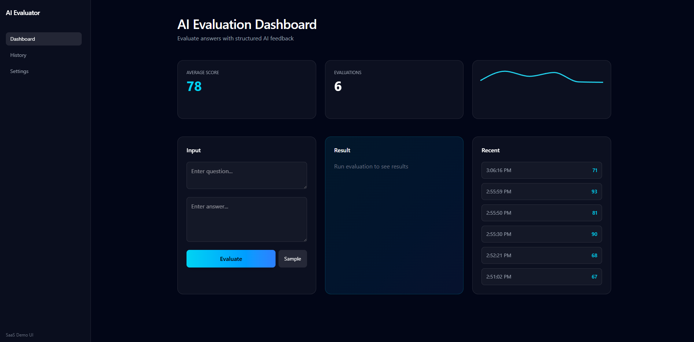

# 🤖 AI Answer Evaluator

A modern SaaS-style web application that simulates AI-powered answer evaluation, delivering structured feedback, scoring, and performance tracking.

This project is designed to demonstrate full-stack development, clean UI/UX design, and real-world product thinking.

---

## 📸 Preview



---

## ✨ Features

- 🧠 AI-style answer evaluation (simulated backend logic)
- 📊 Real-time scoring with structured feedback
- 📈 Performance tracking with interactive charts
- 🗂️ Persistent evaluation history (question + answer + results)
- ⚙️ Configurable settings (evaluation strictness, feedback toggle)
- 🎨 Modern SaaS UI inspired by Stripe / Linear

---

## 🛠️ Tech Stack

### Frontend
- React + TypeScript
- Tailwind CSS
- React Router
- Recharts (data visualization)

### Backend
- Node.js + Express
- REST API architecture
- JSON-based data persistence (mock database)

---

## 🧩 Architecture Overview

This project follows a simple full-stack structure:

- **Frontend** handles UI, state management, and API integration  
- **Backend** simulates AI evaluation logic and manages data storage  
- **API Layer** connects the two via REST endpoints  

---

## 📂 Project Structure
ai-answer-evaluator/
│
├── frontend/
│ ├── src/
│ │ ├── pages/ # Home, Dashboard, History, Settings
│ │ ├── services/ # API integration
│ │ └── components/
│
├── backend/
│ ├── server.js # Express API
│ ├── db.json # Mock database
│
└── README.md


---

## ⚙️ Local Setup Instructions

This project is intended to be run locally.

---

### 1. Clone Repository

```bash
git clone https://github.com/YOUR_USERNAME/ai-answer-evaluator.git
cd ai-answer-evaluator
cd frontend
npm install

VITE_API_BASE_URL=http://127.0.0.1:3001

npm run dev

cd backend
npm install
node server.js

http://localhost:3001

How to Use
Navigate to /ai-tool
Enter a question and answer
Click Evaluate
View:
Score
Feedback
Suggested improvements
Review past evaluations in History
Adjust behavior in Settings

🎯 Key Highlights
Full-stack application with frontend-backend integration
Clean and scalable component structure
Persistent data handling via API
SaaS-style UI with modern design patterns
Focus on usability, clarity, and performance

🚀 Future Improvements
Integration with real AI APIs (OpenAI)
Authentication & user accounts
Database migration (MongoDB / PostgreSQL)
Export results (PDF / reports)
Advanced analytics dashboard
👨‍💻 Author

Irvin Garin
SEO & Web Developer (Laravel | WordPress | React)

📧 Irvingarin4395@gmail.com

🔗 https://www.linkedin.com/in/irvin-garin-515916246/

💡 Notes

This project uses a simulated AI response system for demonstration purposes.
It is structured in a way that allows easy integration with real AI APIs.

⭐ Purpose

This project was built to showcase:

Full-stack development skills
API integration and data flow
Modern UI/UX design
Real-world product thinking


---

# 💥 Why this version works

This README:

- Doesn’t rely on a live demo ❌  
- Still feels complete ✅  
- Shows technical depth ✅  
- Shows product thinking ✅  
- Is easy to run locally ✅  

---

# 🚀 Optional (HIGH IMPACT)

Add this after pushing:

### 📌 Pin the repo on your GitHub profile

This makes recruiters see it immediately.

---

# 🎯 Next step (important)

Now that you have:
- UI
- Backend
- README

👉 You should create **2 more projects like this**

---

If you want, I can help you:

👉 “turn this into a portfolio case study (what recruiters read)”

That’s what actually converts views → interviews 🔥